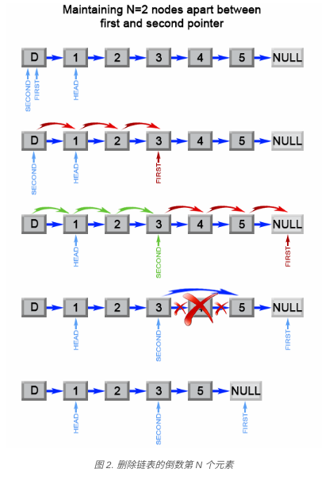
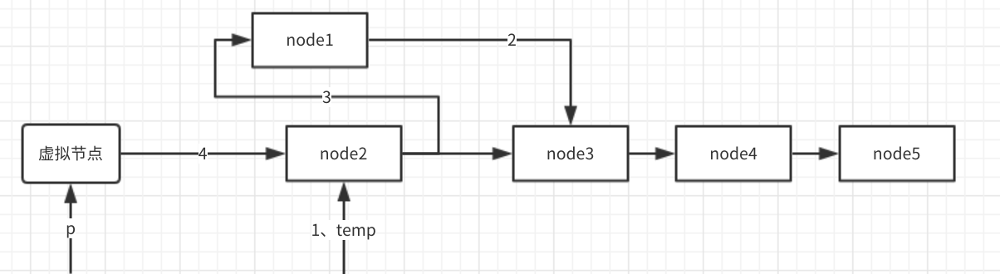
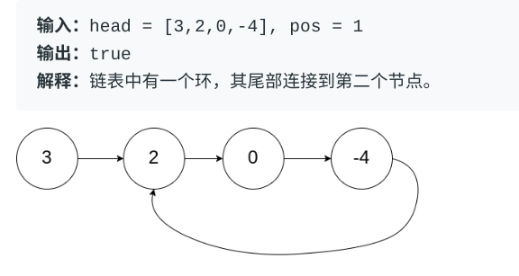
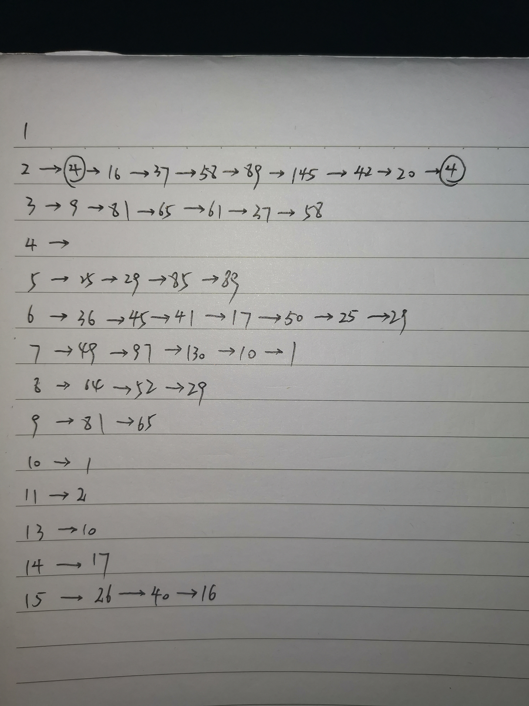

###   						leetcode题解

#### 1、

##### 暴力枚举

```c
int* twoSum(int* nums, int numsSize, int target) {
    static int res[2] = {0}; //静态数组延长数组的生命周期
    for (int i = 0; i < numsSize; i++) {
        int a = nums[i];
        for (int j = i + 1; j < numsSize; j++) {
            if (a + nums[j] == target) {
                res[0] = i;
                res[1] = j;
                
            }
        }
    }
    return res;
}
```

注：因为如果不用静态的话，数组的生命周期就是从定义的地方到函数结束，函数运行结束，这个内存也就释放掉了。返回的是数组的首地址，一旦函数运行结束，这个地址里的东西就变成空了，所以要用静态数组延长数组的生命周期。

##### 两遍哈希表

方法：哈希表正是为此目的而构建的，它支持以 *近似* 恒定的时间进行快速查找。我用“近似”来描述，是因为一旦出现冲突，查找用时可能会退化到 O(n)。但只要你仔细地挑选哈希函数，在哈希表中进行查找的用时应当被摊销为 O(1)O(1)。

一个简单的实现使用了两次迭代。在第一次迭代中，我们将每个元素的值和它的索引添加到表中。然后，在第二次迭代中，我们将检查每个元素所对应的目标元素（target - nums[i]target−nums[i]）是否存在于表中。注意，该目标元素不能是 nums[i]nums[i] 本身！

```c

```

## 						链表

重点：常采用一个虚拟节点放在链表头处，即我们之前学过的头结点，虚拟结点用来简化某些极端情况，例如列表中只含有一个结点，或需要删除列表的头部。					 

#### 					19、删除给定链表中的倒数第n个节点

##### 1.两遍遍历

时间复杂度为O（L）空间复杂度为O（1），操作执行2L-n步，我们第一次遍历该链表可计算出该链表有length个节点，则这道题就是删除这个链表的第（length - n + 1）个节点。第二次遍历删除该节点就好啦。

##### 2.一遍遍历

1. 时间复杂度为O（L），空间复杂度为O（L），操作执行L步，我们采用顺序表每个节点存储该链表的每个节点，操作执行到最后后，删除第（length-n+1）个节点。
2. 时间复杂度：O（L），空间复杂度O（1），操作执行L步，第一个指针从列表的开头向前移动 n+1 步，而第二个指针将从列表的开头出发。现在，这两个指针被 n 个结点分开。我们通过同时移动两个指针向前来保持这个恒定的间隔，直到第一个指针到达最后一个结点。此时第二个指针将指向从最后一个结点数起的第 n 个结点。我们重新链接第二个指针所引用的结点的 `next` 指针指向该结点的下下个结点。



#### 						24、交换链表中两两相邻的节点

将该链表加一个虚拟节点，循环进行两两交换。



#### 						83、删除链表中的重复项

两个节点为一组循环，比较该两节点值，若相等，则删除后一个节点然后继续循环比较，不等则将指针后移，继续循环比较。

#### 						141、环型链表



1. 如何判断一个链表中有环？

   1. 链表第一个节点成环：此时所有节点入度均为1，出度均为1
   2. 链表第一个节点不成环：此时有一个节点入度为2

2. 哈希表：遍历链表，将每个节点地址引用放到哈希表中，若某次该节点地址出现在哈希表中，则有环，若链表中出现空节点，则到链表尾部，没环啦！！！

   1. 时间复杂度：O(n)， 对于含有 n 个元素的链表，我们访问每个元素最多一次。添加一个结点到哈希表中只需要花费 O(1) 的时间。
   2. 空间复杂度：O(n)， 空间取决于添加到哈希表中的元素数目，最多可以添加 n 个元素。 

3. 采用快慢指针：通过使用具有 **不同速度** 的快、慢两个指针遍历链表，空间复杂度可以被降低至 O（1）。慢指针每次移动一步，而快指针每次移动两步。如果列表中不存在环，最终快指针将会最先到达尾部，即快指针为NULL，此时我们可以返回 `false`。若某次快慢指针相等，则表明两指针指向同一区域，重合，有环啦！！

   1. 时间复杂度：O(n)， 让我们将 n 设为链表中结点的总数。为了分析时间复杂度，我们分别考虑下面两种情况。

      - **\*链表中不存在环：***
        快指针将会首先到达尾部，其时间取决于列表的长度，也就是 O(n)。
      - **\*链表中存在环：***
        我们将慢指针的移动过程划分为两个阶段：非环部分与环形部分：
        1. 慢指针在走完非环部分阶段后将进入环形部分：此时，快指针已经进入环中 \text{迭代次数} = \text{非环部分长度} = N迭代次数=非环部分长度=N
        2. 两个指针都在环形区域中：考虑两个在环形赛道上的运动员 - 快跑者每次移动两步而慢跑者每次只移动一步。其速度的差值为1，因此需要经过{二者之间距离}/{速度差值}}速度差值二者之间距离 次循环后，快跑者可以追上慢跑者。这个距离几乎就是 "\text{环形部分长度 K}环形部分长度 K" 且速度差值为 1，我们得出这样的结论 \text{迭代次数} = \text{近似于}迭代次数=近似于 "\text{环形部分长度 K}环形部分长度 K".

      因此，在最糟糕的情形下，时间复杂度为 O(N+K)O(N+K)，也就是 O(n)O(n)。

   2. 空间复杂度：O(1)O(1)， 我们只使用了慢指针和快指针两个结点，所以空间复杂度为 O(1)O(1)。


#### 						160、寻找两链表相交节点

1. 采用类似于140题**成环快慢指针**做法，定义两个指针分别进行链表遍历，若到链表尾部则转到另一个链表开头继续遍历，直至两指针相等或都等于NULL，此时即为结果。时间复杂度O（n）

2. 采用两遍循环，循环每个节点，判断另一个链表中的节点是否有和其地址相同，时间复杂度O（n^2)

   #### 					202、寻找快乐数

题目：一个“快乐数”定义为：对于一个正整数，每一次将该数替换为它每个位置上的数字的平方和，然后重复这个过程直到这个数变为 1，也可能是无限循环但始终变不到 1。如果可以变为 1，那么这个数就是快乐数。

解题：所有不快乐数的数位平方和计算，最後都会进入 4 → 16 → 37 → 58 → 89 → 145 → 42 → 20 → 4 的循环中。

1.n出现重复值就一定是循环的，2.可以根据n值的特征，比如出现某个值就一定是循环的。



#### 						203、移除链表中给定元素

题目：删除链表中等于给定值 **val** 的所有节点。

**示例:**

```
输入: 1->2->6->3->4->5->6, val = 6
输出: 1->2->3->4->5
```

解题：加一个虚拟节点，双指针遍历链表。

#### 						206、反转链表

题目：反转一个单链表。

**示例:**

```
输入: 1->2->3->4->5->NULL
输出: 5->4->3->2->1->NULL
```

**进阶:**
你可以迭代或递归地反转链表。你能否用两种方法解决这道题？

题解：采用三个指针将链表中两两节点进行反转。

#### 						234、回文链表		

题目：请判断一个链表是否为回文链表。

**示例 1:**

```
输入: 1->2
输出: false
```

**示例 2:**

```
输入: 1->2->2->1
输出: true
```

**进阶：**
你能否用 O(n) 时间复杂度和 O(1) 空间复杂度解决此题？

题解：