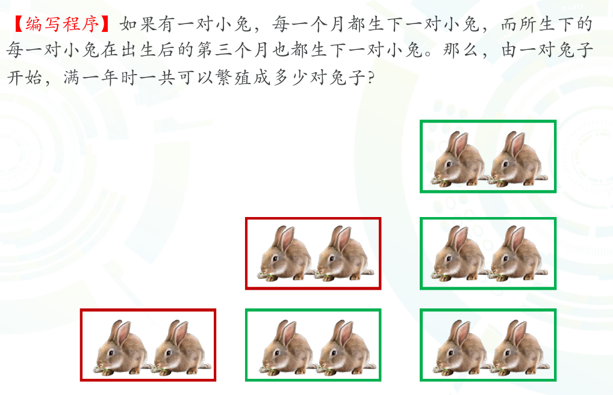
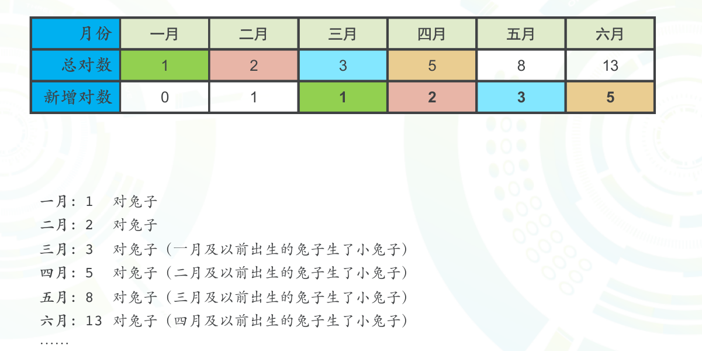
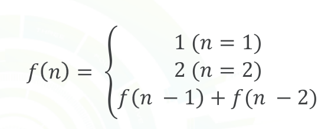
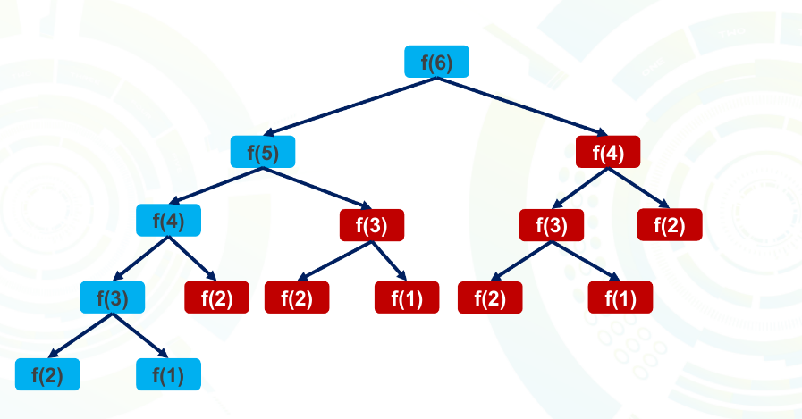

### 第1节、从递推到动归

#### 1、认识递推问题：

兔子繁殖问题：

##### 兔子繁殖思路：

###### 1、确定递推状态：

对于此类递推问题，需要先写出几组数据，确定递推状态，此题中递推状态为f(x)代表第x个月的兔子数量。

###### 2、记忆化优化：

- 一次记忆：如上图所示，求一次f(6)时红色区域为重复计算的区域，可开辟出一个数组进行记忆，当需要使用时直接进行使用，无需再重复计算。
- 整体记忆：多次求值时可以开辟一个全局数组，始终存储。

###### 3、高精度加法：

当求f(50)时答案为负数，此时内存超界，采用大整数加法，两数相加。

###### 4、[程序](https://github.com/wuyunan1/Exercise-Library/blob/master/NOIP/01.rabbit_reproduction.cpp)

